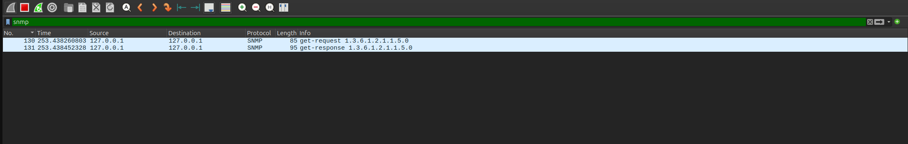
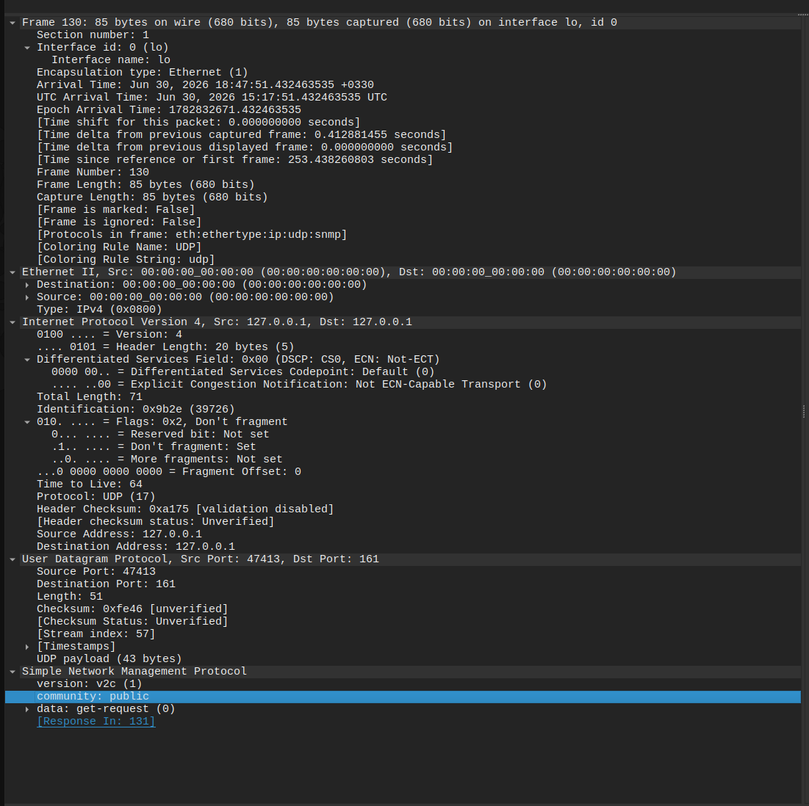
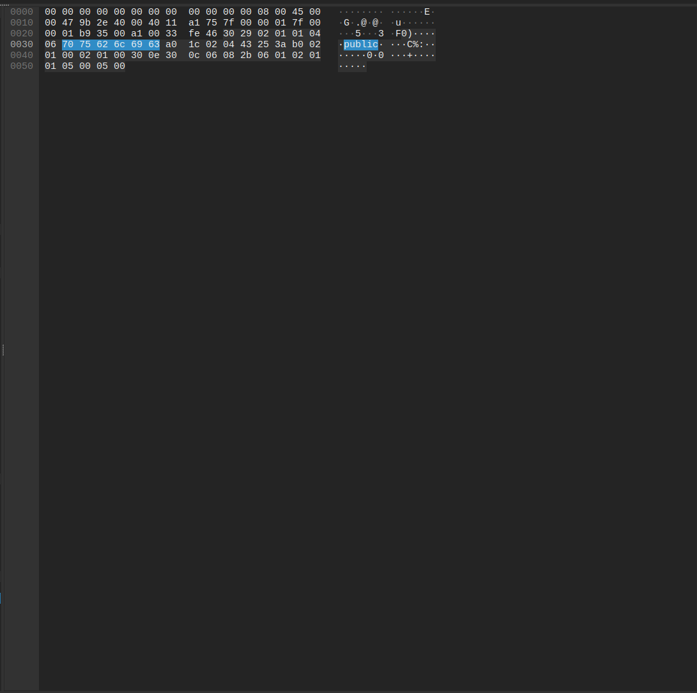

# Inside SNMP: From Packets to Rust

> **Series:** Inside Protocols — Part 1
> Every article follows the same path: **Theory → Packet → Attack → Code → Lab.**

---

## 1. Motivation

How does Zabbix know your CPU usage without ever logging into your Linux server?

How does your monitoring dashboard show the uptime, the interfaces, the running processes of a router you never SSH into?

The answer is a quiet, old, and surprisingly powerful protocol: **SNMP**. In this article we won't just *use* it — we'll watch its packets on the wire, look at it through an attacker's eyes, and then build an SNMP packet **byte by byte in Rust**, with no SNMP library at all.

---

## 2. The Theory

SNMP (Simple Network Management Protocol) is a protocol for monitoring and managing network devices over UDP. Four concepts are enough to start:

- **SNMP** — a request/response protocol running on **UDP port 161**.
- **Manager / Agent** — the *Manager* asks questions (think Zabbix, PRTG); the *Agent* runs on the target device and answers.
- **MIB** — a hierarchical database describing everything an Agent can expose.
- **OID** — a unique, dotted address pointing to one piece of data inside the MIB.

That's the whole mental model. Manager sends a question to an OID, Agent answers.

---

## 3. The Packet

Here's a real SNMP exchange captured in Wireshark — a `get-request` and its `get-response`:


> *The Packet List pane showing both the `get-request` and `get-response` SNMP packets.*

SNMP nests neatly inside the lower layers:

```
Ethernet → IP → UDP (161) → SNMP
                              ├─ Version
                              ├─ Community
                              └─ PDU
                                  └─ Variable Bindings
```

Expanding the packet in Wireshark shows exactly this structure:


> *The fully expanded SNMP tree: version (v2c), community (public), get-request PDU, and the variable-binding OID.*

Now let's decode one OID. The classic example is `sysName`:

```
1.3.6.1.2.1.1.5.0
 │ │ │ │ │ │ │ │ └─ instance (0)
 │ │ │ │ │ │ │ └─── sysName
 │ │ │ │ │ │ └───── system
 │ │ │ │ │ └─────── mib-2
 │ │ │ │ └───────── mgmt
 │ │ │ └─────────── internet
 │ │ └───────────── dod
 │ └─────────────── org
 └───────────────── iso
```

Every number is a step down the MIB tree. `1.3.6.1.2.1.1.5.0` literally reads: *iso → org → dod → internet → mgmt → mib-2 → system → sysName → instance 0.*

---

## 4. The Attack

Switch hats. You're a pentester, and you found UDP 161 open. One command:

```bash
snmpwalk -v2c -c public TARGET
```

If the community string is the default `public` (and it astonishingly often is), the agent hands you:

- **Hostname** and system description
- **Kernel** and OS version
- **Network interfaces** and their addresses
- **Routing table**
- **Installed software**
- **Running processes**

Why does an attacker care? This is enumeration gold. The OS version narrows down which exploits to try. The process and software list reveals what's worth attacking. The interface and routing data maps the internal network for lateral movement — all without a single login.

The lesson for defenders is the flip side: default community strings and SNMP exposed to untrusted networks are a free reconnaissance gift.

---

## 5. The Code

Here's what makes this article different from the hundreds of "run snmpwalk" posts. Instead of leaning on a library, we'll build an SNMP GET packet **by hand** in Rust and send it over a raw UDP socket.

An SNMP packet is encoded in **ASN.1** using **BER (Basic Encoding Rules)**. Every field is a *type-length-value* triple. Once you see it, the magic disappears:

```rust
use std::net::UdpSocket;

fn main() -> std::io::Result<()> {
    // SNMP GET for OID 1.3.6.1.2.1.1.5.0 (sysName.0)
    // Hand-encoded as BER / ASN.1, byte by byte.
    let packet: [u8; 43] = [
        0x30, 0x29,                          // SEQUENCE, length 41
            0x02, 0x01, 0x01,                // INTEGER: version = 1 (v2c)
            0x04, 0x06, 0x70,0x75,0x62,0x6c,0x69,0x63, // OCTET STRING: "public"
            0xa0, 0x1c,                      // PDU: GetRequest, length 28
                0x02, 0x04, 0x12,0x34,0x56,0x78, // INTEGER: request-id
                0x02, 0x01, 0x00,            // INTEGER: error-status = 0
                0x02, 0x01, 0x00,            // INTEGER: error-index = 0
                0x30, 0x0e,                  // SEQUENCE OF: variable-bindings
                    0x30, 0x0c,              // SEQUENCE: one varbind
                        // OID: 1.3.6.1.2.1.1.5.0
                        0x06, 0x08, 0x2b,0x06,0x01,0x02,0x01,0x01,0x05,0x00,
                        0x05, 0x00,          // NULL (the value slot, empty for GET)
    ];

    let socket = UdpSocket::bind("0.0.0.0:0")?;
    socket.send_to(&packet, "127.0.0.1:161")?;
    println!("Sent {} bytes", packet.len());

    let mut buf = [0u8; 1500];
    let (n, src) = socket.recv_from(&mut buf)?;
    println!("Received {} bytes from {}", n, src);
    println!("Raw response: {:02x?}", &buf[..n]);

    // Crude extraction of the last OCTET STRING — the sysName value.
    if let Some(last) = buf[..n].iter().rposition(|&b| b == 0x04) {
        let len = buf[last + 1] as usize;
        let val = &buf[last + 2..last + 2 + len];
        println!("sysName = {}", String::from_utf8_lossy(val));
    }

    Ok(())
}
```

The data flows like this:

```
Rust → UDP Socket → ASN.1 → BER Encoding → SNMP Packet → Linux Agent
```

Notice the bytes `0x70 0x75 0x62 0x6c 0x69 0x63` — that's `public` in ASCII. The exact same bytes Wireshark highlighted earlier:


> *Clicking the `community` field highlights `70 75 62 6c 69 63` in the hex pane — the same bytes we hard-coded in Rust.*

That correspondence — the same packet whether it came from `snmpget` or from our handful of Rust bytes — is the whole point. There is no magic in the protocol, only encoding.

---

## 6. The Lab

Everything above is reproducible in a couple of minutes.

**Tools:** Docker, `snmpd`, Wireshark, tcpdump, snmpwalk.

Bring up an SNMP agent:

```bash
docker run -d --name snmp-lab -p 161:161/udp polinux/snmpd
```

Or with `docker-compose.yml`:

```yaml
services:
  snmp-agent:
    image: polinux/snmpd
    container_name: snmp-lab
    ports:
      - "161:161/udp"
```

Confirm it answers:

```bash
snmpwalk -v2c -c public localhost
snmpget -v2c -c public localhost 1.3.6.1.2.1.1.5.0
```

**Exercises:**

1. Find the OID for the system's **Load Average**.
2. Change the community string from `public` to `private` and test again.
3. Start a Wireshark capture, run our Rust program, and confirm the packet it sends matches the one `snmpget` produces — byte for byte.

> ⚠️ **Only test systems you own or have explicit permission to test.** Everything here targets a local lab container.

---

## 7. Conclusion

We went from a vague question — *how does monitoring software see inside a machine it never logs into?* — all the way down to individual bytes on the wire, and back up through Rust.

In the next article, we'll implement a full SNMP GET request from scratch in Rust — **no SNMP library, no hand-typed byte arrays** — building the ASN.1/BER encoder ourselves, OID and all.

---

*All code and lab files for this series live at:* `github.com/itsMehrnaz/inside-protocols`
